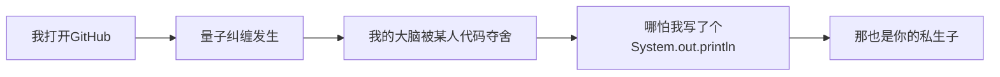

# 关于SKID?!
## 一. 兼论某些天才独创的学术判定法则

### Chapter 1 - 开天辟地的抄袭新定义
> **法则1**：查看开源代码 = 抄袭成立  
> *推论*：程序员呼吸空气时，他人仓库灵魂已被无形中污染  
> *建议*：为防止思想感染，请编程时全程蒙住口鼻  

某人开创性地将「打开仓库」等同于抄袭行为，乃计算机领域的重大突破。依照该逻辑：  
- 厨师看过菜谱 → 侵犯知识产权  
- 作家读过小说 → 文学抢劫犯  
- 人类呼吸空气 → 剽窃地球原始大气层  

### Chapter 2 - 注释语言测谎仪
> **法则2**：注释风格突变 = AI润色铁证  
> *"科学"依据*：人类不可能某天突然写出正式注释  

TRUTH  ○→  LIE

本人注释风格从「// Who knows why?」跳跃到「// 确保颜色和显示正常」，在某人眼中堪比：  
- 王安石写变法条文 → 被害死的原因  
- 今早没吃韭菜盒子 → 必定被AI夺舍  

### Chapter 3 - 举证责任转移术
> **法则3**：我主张你犯罪 → 你自证未犯罪  
> *附加条款*：若你证伪成功 → 则证明你反侦察能力过强  

某人要求我「证明没有用AI」的操作，堪比：  
- 让百姓证明自己不是外星间谍  
- 让特朗普证明自己再次参选总统不是为了策反

### Chapter 4 - 皇帝的新证据
当某人从「代码抄袭」退守到「AI润色」阵地时：  
- 实质性证据遁入量子态  
- 逻辑链条完成形而上学升华  

## 二. 自证三件套 
1. 人格分裂鉴定报告（解释为何注释千奇百怪）  
2. 键盘摄像头24小时监控（证明代码亲自编写）
3. ToDesk向日葵全套远控（实时管理代码编写）

## 三. 建议
> 若你仍需指控，下次不妨说我使用**量子波动速读**隔空抄写你的高贵代码，和你的理论同样坚实且富有科幻美感。  

Aerolite Society.
